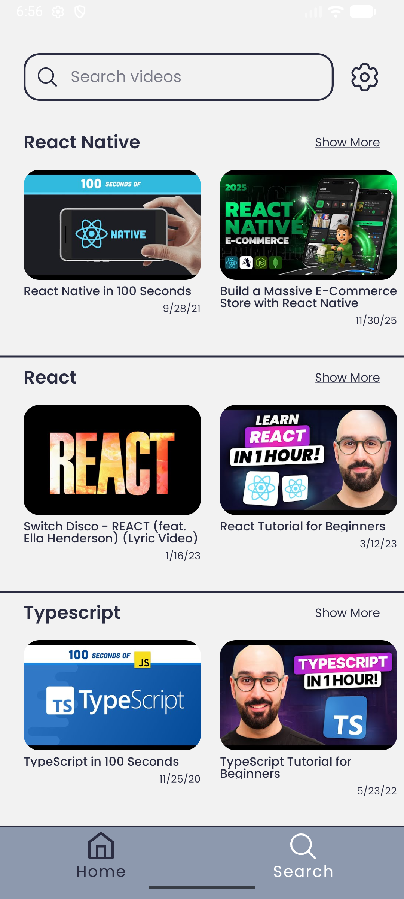
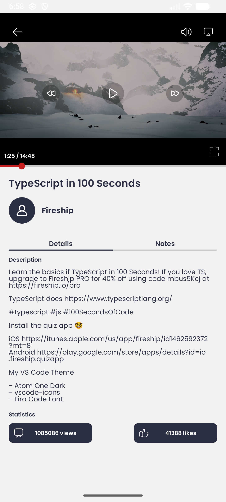
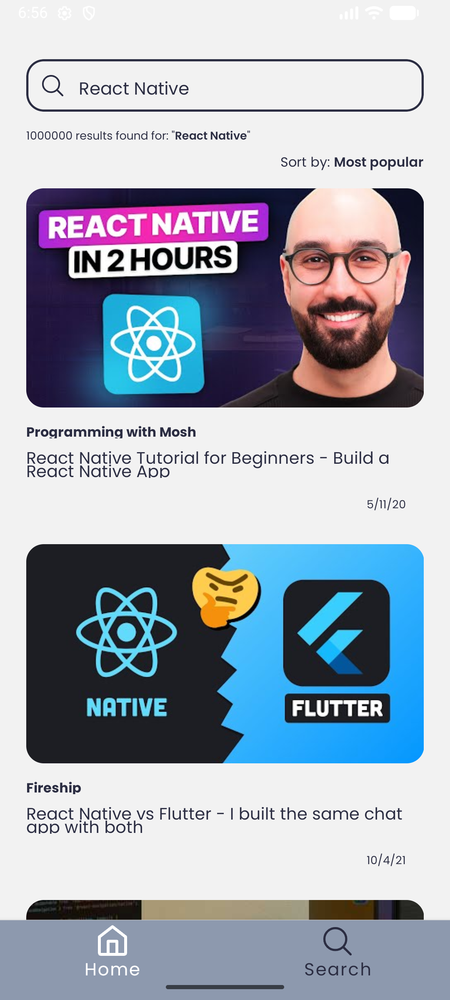
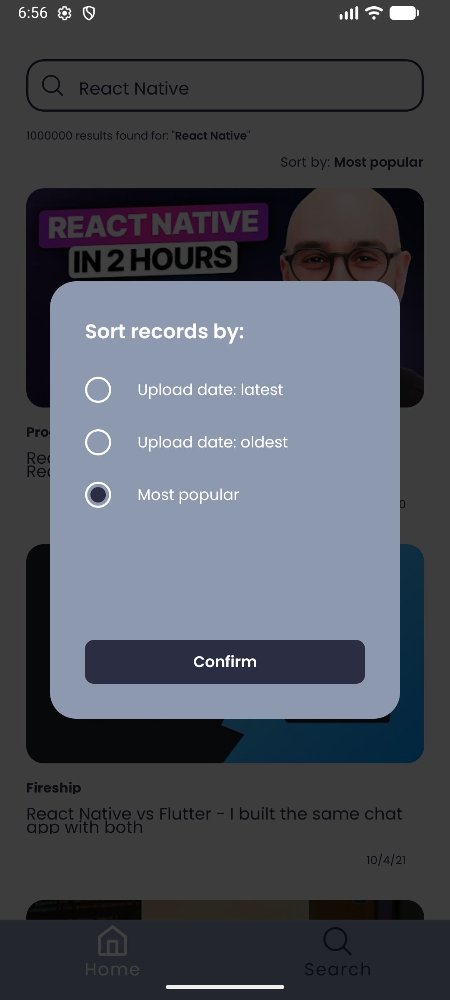

# Youtube Learn

## Gallery

| Login                | Home                 | Video Details        | Search               | Sort Modal                  |
|-----------------------------|-----------------------------|----------------------------|-----------------------------|-----------------------------|
|  |  |  |  |  |

## Get started

*Tested on **Windows 11 (WSL2)** with **Node.js v24.11.1** and **Android Studio emulator** in development build mode.*

1. Follow the instructions to set up your development environment:

- [Android Emulator](https://docs.expo.dev/get-started/set-up-your-environment/?platform=android&device=simulated&mode=development-build&buildEnv=local)
- [Android Physical Device](https://docs.expo.dev/get-started/set-up-your-environment/?platform=android&device=physical&mode=development-build&buildEnv=local)

2. Install dependencies

   ```bash
   npm install
   ```

3. Start the app

   ```bash
   npm run android
   ```

This should open the app in your Android emulator or connected physical device.
